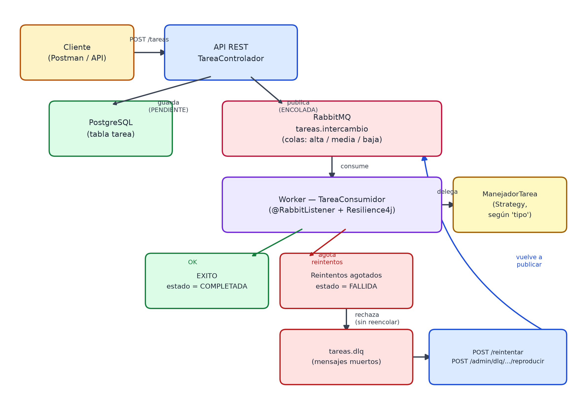

# Sistema de Procesamiento Asíncrono

API REST en Java + Spring Boot que recibe tareas, las encola por prioridad en RabbitMQ y las procesa en segundo plano con reintentos automáticos, Dead Letter Queue y soporte de tareas programadas/recurrentes.



## Stack

Java 21 · Spring Boot 4.1 · PostgreSQL + Flyway · RabbitMQ · Quartz · Resilience4j · Micrometer · Testcontainers

## Cómo levantarlo

Requisitos previos: PostgreSQL corriendo de forma nativa (no en Docker) con la base de datos `procesamiento_asincrono` creada, y Docker Desktop arrancado para RabbitMQ.

```bash
docker compose up -d